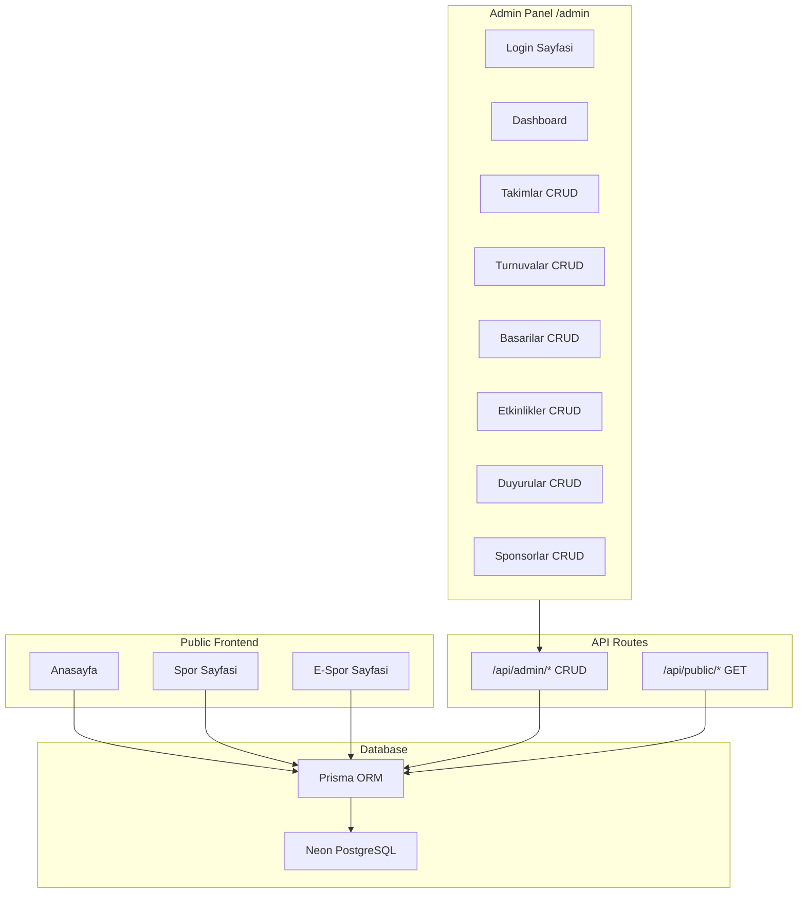

# Admin Paneli ve Veritabani Entegrasyonu

## Mimari




## Veritabani: Prisma + Neon PostgreSQL

- **Neon** (neon.tech) ucretsiz plan: 0.5 GB depolama, sinirsiz DB
- Prisma ORM ile schema tanimi, migration, type-safe sorgular
- Hostinger'a tasinirken sadece `DATABASE_URL` env var degistirmek yeterli (MySQL veya PostgreSQL)
- Prisma provider degisimi tek satirlik islem

### Prisma Schema (6 tablo)

`prisma/schema.prisma` dosyasinda tanimlanacak tablolar:

- **Team**: id, name, category, sport_type, members_count, description, image_url
- **Tournament**: id, name, category, date, location, status, description, image_url
- **Achievement**: id, title, category, date, description, teamId
- **Event**: id, title, category, date, location, description, image_url
- **Announcement**: id, title, category, date, summary, pinned
- **Sponsor**: id, name, logo_url, order

## Auth Sistemi

- Tek admin kullanici (env var'dan `ADMIN_USERNAME` + `ADMIN_PASSWORD`)
- **jose** kutuphanesiyle JWT token olusturma
- httpOnly cookie ile session yonetimi
- `src/middleware.ts` ile `/admin` route'lari koruma (login haric)
- Sifre bcrypt ile hash'lenecek (karsilastirma icin)

## Admin Panel Sayfalari

Tum admin sayfalari `/admin` altinda, ayri bir layout ile (sidebar + header):

- `/admin/login` - Giris formu
- `/admin` - Dashboard (toplam istatistikler)
- `/admin/takimlar` - Takimlar listesi + ekle/duzenle/sil
- `/admin/turnuvalar` - Turnuvalar listesi + ekle/duzenle/sil
- `/admin/basarilar` - Basarilar listesi + ekle/duzenle/sil
- `/admin/etkinlikler` - Etkinlikler listesi + ekle/duzenle/sil
- `/admin/duyurular` - Duyurular listesi + ekle/duzenle/sil
- `/admin/sponsorlar` - Sponsorlar listesi + ekle/duzenle/sil

Her sayfa: tablo gorunumu + modal form (ekle/duzenle) + silme onay dialog

## API Routes

- `/api/admin/auth/route.ts` - POST login, DELETE logout
- `/api/admin/teams/route.ts` - GET list, POST create
- `/api/admin/teams/[id]/route.ts` - GET, PUT, DELETE
- Ayni yapi: tournaments, achievements, events, announcements, sponsors
- Tum admin API'leri JWT dogrulamasi gerektirir

## Frontend Degisiklikleri

- `src/lib/data.ts` statik import yerine Prisma ile dogrudan DB sorgusu
- [page.tsx](frontend/src/app/page.tsx), [spor/page.tsx](frontend/src/app/spor/page.tsx), [e-spor/page.tsx](frontend/src/app/e-spor/page.tsx) server component'larda Prisma kullanimi
- Mevcut API route'lari (`/api/teams` vs.) DB'den okuyacak sekilde guncelleme

## Kurulacak Paketler

```
npm install prisma @prisma/client jose bcryptjs
npm install -D @types/bcryptjs
```

## Env Variables (Vercel'e eklenecek)

```
DATABASE_URL=postgresql://...@...neon.tech/...
ADMIN_USERNAME=admin
ADMIN_PASSWORD=...
JWT_SECRET=...
```

## Seed

- `prisma/seed.ts` mevcut `data.ts` verisini DB'ye yazacak
- `npx prisma db seed` ile calistirilacak

